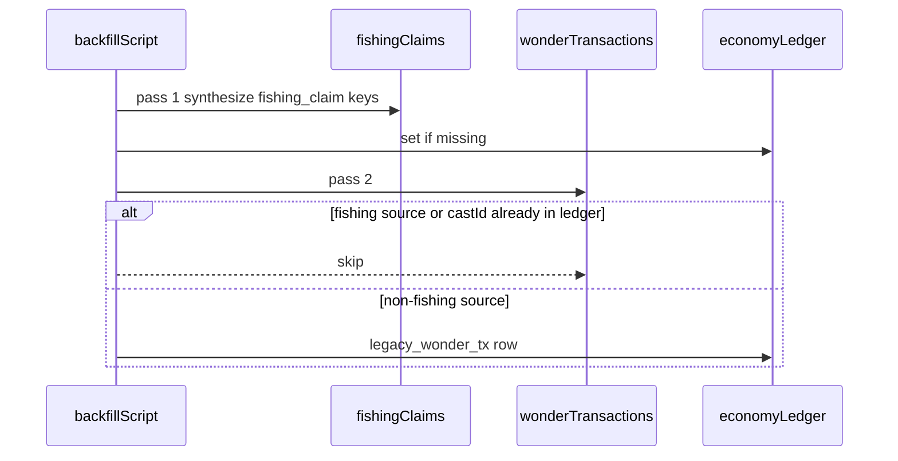

# Economy Known Behaviors — Ops Reference

**Canonical operator doc** for intentional economy behaviors that can look like bugs during Phase C ops, reconciliation, or Invariant monitoring. **Not balance bugs** unless noted.

**Related:** [Phase C verification](economy-phase-c-verification.md) · [Invariant 3](economy-invariant3-verification.md) · [Invariant 4](economy-invariant4-verification.md) · [Invariant 7](economy-invariant7-verification.md) · [Invariant 10](economy-invariant10-verification.md)

## Optimization step 0 — Path A (greenfield)

Before first user: deploy Phase C code and set `ECONOMY_LEDGER_ONLY=true` on Cloud Functions runtime so commits skip `wonderTransactions` dual-write. See [Phase C cutover](economy-phase-c-verification.md#prod-cutover--economy_ledger_only).

---

## Authority matrix

| Store                                                        | Authority                                                                             | Reconcile checks                 |
| ------------------------------------------------------------ | ------------------------------------------------------------------------------------- | -------------------------------- |
| `economyLedger`                                              | Source of truth for wonder, parts, materials, lifetime earn replay, bait audit replay | Folded by `reconcileUser`        |
| `users/{uid}` projection                                     | Written atomically from ledger fold in `commitEconomyAction`                          | Compared to ledger fold          |
| `inventory.baits`                                            | User patch + `cast_create` / `bait_craft` audit rows                                  | Reconcile v2 replays from ledger |
| Daily counters (`fishingWonderToday`, `dailyQuestionCount`)  | Lazy UTC reset on well/fishing actions                                                | Not reconciled                   |
| `playerRods`, `creatures`, `fishingClaims`, analytics, diary | Side effects / progression                                                            | Not reconciled                   |

---

## Consistency model

Single Firestore transaction per economy action:

1. Idempotency read
2. User read + optional lazy counter reset (Invariant 4 exempt)
3. Ledger entry build + projection fold + solvency guard
4. `tx.set` `economyLedger` + user projection + idempotency
5. Optional `wonderTransactions` dual-write when not `ECONOMY_LEDGER_ONLY`

Fishing claim side effects (`creatures`, `fishingClaims`, analytics) run only when `committed === true`.

---

## Decision log

**Why `inventory.baits` is off-ledger:** consumable stacks change via `additionalUserPatch` on craft/cast; ledger stores audit rows (`bait_craft`, `cast_create`) with `baitKey` / `baitUsed` metadata. Materials (`baitMaterials`) stay on-ledger for fold + reconcile.

**Why lazy counter reset:** hourly full-`users` scan removed; counters reset when user opens well or fishes after UTC midnight (`applyOperationalCounterResetsInTransaction`).

**Why backfill skips fishing wonderTx:** `fishingClaims` pass runs first; wonderTx pass skips fishing sources and castIds already covered — prevents double-count ledger rows.

---

## Cost model

| Commit path        | Ledger reads                                                                  |
| ------------------ | ----------------------------------------------------------------------------- |
| Default            | Full `economyLedger` scan (up to `MAX_LEDGER_READS_PER_TX` = 450)             |
| Checkpoint + tail  | `economyLedgerCheckpoint/summary` + tail query after `foldedThroughTimestamp` |
| Compaction trigger | `COMPACT_THRESHOLD` = 350 entries; tail hard limit 300                        |

See [`compactionConstants.ts`](../shared/sanctuary/economy/compactionConstants.ts) and [Phase C compaction](economy-phase-c-verification.md#ledger-read-cap--checkpoint-compaction).

---

## Scaling triggers

| Signal                   | Threshold                                 | Action                                                                  |
| ------------------------ | ----------------------------------------- | ----------------------------------------------------------------------- |
| `users` collection size  | > 10,000                                  | Review daily reconciliation batch size; monitor compaction job duration |
| `LEDGER_READ_LIMIT` logs | any user                                  | Run `adminCompactEconomyLedger` for affected UID                        |
| Drift report             | `\|drift\| > 2` on any scalar or bait key | Sample `adminReconcileUser`; inspect duplicate keys post-backfill       |

---

## Topic 1 — Historical fishing metadata (pre–Inv 10)

New `fishing_claim` rows include `outcome`, `creatureTypeId`, `duplicate`, and correct `source`. Older rows may lack fields — **replay uses numeric deltas only** ([`foldLedger.ts`](../shared/sanctuary/economy/foldLedger.ts)). Not a Path A blocker.

---

## Topic 2 — Lazy daily counter reset

[`applyOperationalCounterResetsInTransaction`](../functions/src/sanctuary/dailyCounters.ts) resets `fishingWonderToday` + `dailyQuestionCount` when UTC day rolls — **no** ledger row, **no** idempotency.

**Wired on:** fishing claim ([`claimEncounter.ts`](../functions/src/sanctuary/claimEncounter.ts)), create cast ([`createCastTransaction.ts`](../functions/src/sanctuary/createCastTransaction.ts)), well assign + reflection ([`getOrAssignTodaysQuestion.ts`](../functions/src/sanctuary/well/getOrAssignTodaysQuestion.ts), [`submitWellReflection.ts`](../functions/src/sanctuary/well/submitWellReflection.ts)).

`resetDailyCountersHourly` **removed** — no hourly full-`users` scan.

---

## Topic 3 — Non-ledger server writes (Invariant 4 exempt)

See [Invariant 4 exempt table](economy-invariant4-verification.md#exempt-user-patches-not-ledger-events) (link to this hub for full list).

**Key distinction:** `inventory.baits` (consumables) vs `inventory.baitMaterials` (craft inputs).

---

## Topic 4 — Reconcile scope (v2)

[`reconcileUser.ts`](../functions/src/sanctuary/economy/reconcileUser.ts) compares ledger fold vs user doc for:

- `currentWonder`, `storedWonder`, `parts`, `baitMaterials.*`
- `lifetimeWonderEarned` (from full ledger via `computeLifetimeWonderEarned`)
- `inventory.baits` (replayed via [`foldBaitInventoryFromLedger`](../shared/sanctuary/economy/foldBaitInventory.ts) from `bait_craft` + `cast_create` audit rows)

**Still not checked:** daily counters, `playerRods`, creatures, fishingClaims, subscription, diary.

**Caveat:** pre-ledger bait history not in fold → Path B users may show bait drift until backfilled or accepted.

`hasDrift: false` means checked fields match — not full user-doc parity.

---

## Topic 5 — Path B backfill

Script: [`backfill-economy-ledger-from-wonder-tx.js`](../functions/scripts/backfill-economy-ledger-from-wonder-tx.js) (automated tests in `backfill-economy-ledger-from-wonder-tx.test.mjs`).

### 5a — Ledger-only

Writes `economyLedger` only — does not rewrite `users/{uid}` snapshots. Run `adminReconcileUser` after commit.

### 5b — Double-count prevention (code)

Script order: **fishingClaims first**, then `wonderTransactions`. WonderTx rows are skipped when:

- `source` is a fishing wonder source, or `actionType === "fishing_claim"`, or
- `metadata.castId` is in the fishingClaims castId set, or
- `fishing_claim:{castId}` ledger doc already exists

### Post-backfill drift playbook

| Drift sign     | Likely cause                                            | Action                                             |
| -------------- | ------------------------------------------------------- | -------------------------------------------------- |
| Ledger > user  | incomplete user snapshot or legacy duplicate before fix | inspect keys; do **not** auto-rewrite user doc     |
| User > ledger  | missing ledger rows                                     | re-run backfill; check `lessonProgress` gap (5d)   |
| Materials only | feather-only backfill (5c)                              | cosmetic; `compensateEconomyEntry` if ops-critical |
| Baits only     | pre-ledger bait history                                 | document or compensate                             |

### 5c — Materials simplification

`materialsAwarded` → **feather** bucket on fishingClaims backfill.

### 5d — lessonProgress gap

Not implemented in backfill script. Lesson-only legacy users may drift until handled.

---

## Topic 6 — Fishing daily wonder cap at persistence

[`applyFishingClaim.ts`](../functions/src/sanctuary/applyFishingClaim.ts) caps wonder before ledger write. Engine may compute higher; persisted deltas are cap-trimmed.

---

## Topic 7 — Admin compensation

[`compensateEconomyEntry`](../functions/src/sanctuary/economy/compensateEconomyEntry.ts) — append-only `compensation` rows via `commitEconomyAction`.

---

## Topic 8 — Idempotency: no “second ledger row”

Retries with the same key return cached response — no duplicate `economyLedger` row. See [Invariant 3](economy-invariant3-verification.md).

---

## Topic 9 — Environment and infrastructure

| Item                  | Note                                                                   |
| --------------------- | ---------------------------------------------------------------------- |
| DEV preview           | No economy writes ([Inv 6](economy-invariant6-verification.md))        |
| Client reads          | `users/{uid}` onSnapshot only                                          |
| Admin SDK             | Backfill, reconcile, compaction bypass client rules                    |
| Checkpoint compaction | Ledger rows never deleted — [Phase C](economy-phase-c-verification.md) |

---

## Topic 10 — Scheduler scale

| Job                                | Pattern     |
| ---------------------------------- | ----------- |
| `scheduledEconomyReconciliation`   | Daily batch |
| `scheduledEconomyLedgerCompaction` | Daily batch |

Revisit batch patterns if `users` > 10,000.

---

## Future optimization (deferred)

| Item                                  | Rationale                                                  |
| ------------------------------------- | ---------------------------------------------------------- |
| `deltaBaits` on ledger schema         | Larger migration; audit replay sufficient for reconcile v2 |
| `lessonProgress` backfill             | Separate script                                            |
| Metadata/material enrichment          | Cosmetic                                                   |
| Split economy vs progression services | Architectural                                              |

---

## Documented elsewhere

| Item                            | Pointer                                            |
| ------------------------------- | -------------------------------------------------- |
| `wonderTransactions` dual-write | [Phase C cutover](economy-phase-c-verification.md) |
| IAP `purchase_verify`           | Normal `commitEconomyAction` path                  |
| PostHog `craft_abandoned`       | [posthog-verification.md](posthog-verification.md) |
