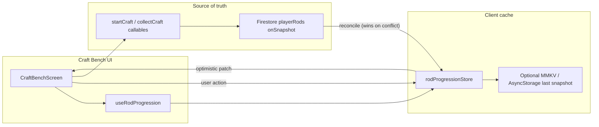
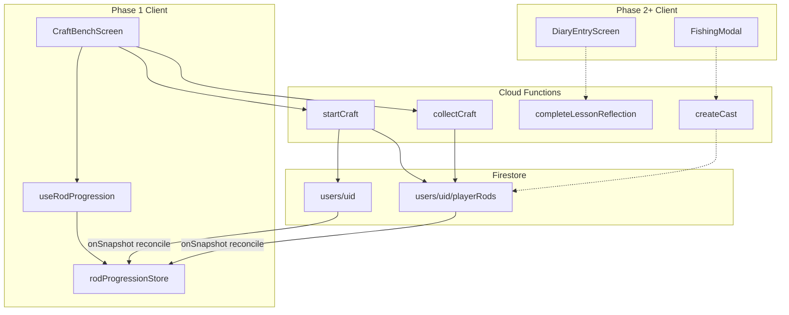

# Rod Progression Plan v2

Source: `[rod_progression_plan_v2.md](/Users/hjcfung/Downloads/rod_progression_plan_v2.md)`, reconciled with `[shared/sanctuary/rods/catalog.ts](shared/sanctuary/rods/catalog.ts)` and current codebase.

---

## Why this system exists

Rods are **not rewards — they are evidence**. Parenting change takes months before a child's behaviour shifts. The pond honours consistent reading and reflection by leaving something tangible behind.

Each crafted rod carries the emotional signature of its module. Fishing with the fire rod means fishing with the part of the parent who learned to stay calm under pressure. Creatures caught are expressions of that growth.

---

## Design principles

1. **First rod feels close** — `basic` is free; first craftable rare (fire) achievable in 3–4 weeks of consistent use.
2. **Progress legible without tracking** — no percentage bars or "3/8 parts." Workbench rod illustration fills in as lessons complete.
3. **Wonder from reflection, not grinding** — fishing does not award parts or build rods; lessons and diary do.
4. **Each rod anchored to a module theme** — element metaphor must feel true to a tired parent.
5. **Nothing expires during crafting** — rod wear exists for fishing engagement only; never punishes paused craft progress.
6. **Wonder is invested, not spent** — at craft start, stored Wonder moves into the rod-in-progress (`wonderInvested`). Server may debit `storedWonder`, but **all parent-facing copy** frames this as settling Wonder into the work — never as a penalty or loss. A parent who steps away for two weeks returns to a **finished rod waiting for them**; that is a gift, not punishment.
7. **Parent language, not game language** — Firestore keeps internal states (`locked`, `craftable`, …). Craft Bench UI uses **Waiting / Ready to begin / Taking shape / Complete / In hand** only. Never show _locked_, _unlock_, or lock icons.
8. **Epics are post-curriculum, not a revisit wall** — epic craftability requires all lessons complete + matching rare in hand + accumulated Wonder/parts from the journey. No lesson revisits, no second curriculum.

---

## Current state vs v2 changes

| Live today                                                                 | v2 change                                                                               |
| -------------------------------------------------------------------------- | --------------------------------------------------------------------------------------- |
| Subscription unlocks all rare/epic rods client-side                        | Element rods earned via lesson clusters + craft                                         |
| Server does not validate rod ownership on cast                             | `createCast` validates `playerRods` state                                               |
| Craft costs in catalog; no server/UI                                       | `startCraft` / `collectCraft` callables                                                 |
| `inventory.parts` never awarded/spent                                      | Parts from diary; applied at `startCraft`                                               |
| Wonder gates fish at claim (keep)                                          | Unchanged                                                                               |
| `isPremium` in `[FishingModal.tsx](src/features/fishing/FishingModal.tsx)` | Remove after server validation live                                                     |
| Subscription = rod access                                                  | Subscription = **lesson access** only (`[gating.ts](src/services/classroom/gating.ts)`) |

---

## Module → rod assignment

One sentence each — emotional logic drives element choice:

| Module   | Theme                                    | Rod              | Domain ID                     | Why this element                                                                  |
| -------- | ---------------------------------------- | ---------------- | ----------------------------- | --------------------------------------------------------------------------------- |
| —        | Starter                                  | Basic            | `basic`                       | Free rod at the gate; common pool only                                            |
| 1        | Regulate emotions together               | Fire rare        | `rare_fire`                   | Big feelings need containment and steady hands                                    |
| 2        | Cooperate and set limits with connection | Water rare       | `rare_water`                  | Shapes by flowing around — limits with warmth                                     |
| 3        | Support intrinsic motivation             | Wind rare        | `rare_wind`                   | Cannot be held, only directed — space not push                                    |
| 4        | Grow through failure and discomfort      | Electric rare    | `rare_electric`               | Friction made useful — discomfort as spark                                        |
| 5        | Shape identity and integrate long-term   | Wildcard rare    | `rare_wildcard`               | Gift when all four rare rods are in hand — pond opens wider                       |
| 1–4 deep | Same element, deeper                     | Epic per element | `epic_fire` … `epic_electric` | **Post-curriculum** — deeper pool after full journey; no lesson revisits required |

**Epics are not new elements** — same element, deeper pool (`epic1`–`epic4` creature keys unchanged).

---

## Rod catalog and craft costs

Keep existing **domain IDs** (`[ROD_CATALOG](shared/sanctuary/rods/catalog.ts)`); update `ROD_CRAFT_COSTS` to v2 values.

### Tier 1 — Basic (`basic`)

- **Unlock:** Free, no craft; always equipped for new users.
- **Pool:** `basic` — 30 common creatures.
- **Copy:** "The rod you found leaning against the gate…"

### Tier 2 — Rare rods (Modules 1–4)

Complete **full module lesson cluster** + **invest** stored Wonder + **apply** parts (single global pool).

| Rod             | Module cluster | Parts | Stored Wonder | Craft duration |
| --------------- | -------------- | ----- | ------------- | -------------- |
| `rare_fire`     | `1.1`–`1.6`    | 4     | 25            | 1 day          |
| `rare_water`    | `2.1`–`2.6`    | 5     | 35            | 2 days         |
| `rare_wind`     | `3.1`–`3.6`    | 5     | 35            | 2 days         |
| `rare_electric` | `4.1`–`4.6`    | 6     | 45            | 3 days         |

Fire is intentionally easiest (early win in Module 1). Each tier steps up with module depth.

### Tier 2b — Wildcard (`rare_wildcard`) — journey gift

**Not a craft sink.** Wildcard is a **capstone gift** for parents who have brought all four rare rods **in hand** (internal `ready` or `equipped` on `rare_fire`, `rare_water`, `rare_wind`, `rare_electric`).

| Trigger                    | Behavior                                                                                                                     |
| -------------------------- | ---------------------------------------------------------------------------------------------------------------------------- |
| All four rare rods in hand | `evaluateCraftableStates` / `grantWildcardGift` sets `rare_wildcard` → internal **`ready`** (skips `craftable` / `crafting`) |
| Workbench                  | Wildcard **sketch appears automatically** on the bench — a new possibility, not another checklist item                       |
| Parts / Wonder             | **None** — no investment, no timer                                                                                           |
| Collect                    | Single narrative moment: parent taps to welcome the rod → internal `equipped`                                                |

**Narrative prompt (required):** _"The pond feels wider now. Something is waiting."_

**Design intent:** A parent who finished four modules and crafted four rods may already feel "done." Wildcard must feel like the pond opening wider — a gift for completing the journey, not an obligation to grind 10 more parts.

**Fishing:** Unions all element rare pools (not epic/legendary/prestige) — unchanged.

**No Module 5 lesson gate** on the rod itself (Module 5 lessons remain subscription-gated separately; reaching four rare rods already implies deep curriculum engagement including Module 4 / Fiberglass for `rare_electric`).

### Tier 3 — Epic rods (post-curriculum)

**Epics are optional depth after the core journey — not a second curriculum.** Parents who finished all lessons have already proven engagement; epics must not ask them to revisit lessons or grind for parts.

**Unlock to internal `craftable` (all required):**

| Gate                 | Rule                                                                                                   |
| -------------------- | ------------------------------------------------------------------------------------------------------ |
| Curriculum complete  | All **31 lessons** completed with reflection (`lessonProgress` complete for full catalog)              |
| Element rare in hand | Matching `rare_*` internal `ready` or `equipped`                                                       |
| Balances             | Sufficient `inventory.parts` + `storedWonder` for that epic (invested at `startCraft` like other rods) |
| Subscription         | Lesson access for that element's module (same craft gate as rare)                                      |

**Explicitly NOT required:** lesson revisits, atlas count, wildcard, fishing catches, or any new lesson cluster.

**Design intent:** Wonder and parts for epics come from the same journey — diary depth, Well, practice, module cluster bonuses. A one-pass parent who completes the full curriculum earns enough parts for four rares **and** four epics with a small surplus (see economy check). Revisit bonus (+1) remains optional enrichment, never an epic gate.

| Rod             | Prerequisite                                       | Additional parts | Additional stored Wonder | Duration | Total Wonder invested             |
| --------------- | -------------------------------------------------- | ---------------- | ------------------------ | -------- | --------------------------------- |
| `epic_fire`     | `rare_fire` in hand + **all lessons complete**     | +8               | +25                      | 5 days   | 90 (25+25+40 narrative alignment) |
| `epic_water`    | `rare_water` in hand + **all lessons complete**    | +8               | +25                      | 5 days   | 90                                |
| `epic_wind`     | `rare_wind` in hand + **all lessons complete**     | +8               | +25                      | 5 days   | 90                                |
| `epic_electric` | `rare_electric` in hand + **all lessons complete** | +8               | +25                      | 5 days   | 90                                |

Rare rod **preserved** after epic craft (collection completion).

**Workbench copy when epic becomes craftable:** _"You're going deeper. This rod knows it."_ (post-curriculum tone — invitation, not homework.)

---

## Parts economy

**Module-agnostic single pool** on `users/{uid}.inventory.parts` (field exists; wire award/spend).

| Action                                                               | Parts        | Notes                                                  |
| -------------------------------------------------------------------- | ------------ | ------------------------------------------------------ |
| Diary submitted (lesson complete)                                    | +1           | Base; reflection required, not video watch             |
| Lesson revisited (opened 7+ days after first complete)               | +1 bonus     | Spaced return — optional, not required for core path   |
| Module cluster fully completed (all lessons + reflections in module) | **+5 bonus** | One-time per module; rewards finishing a whole chapter |
| Fishing (any outcome)                                                | 0            |                                                        |
| Well reflection                                                      | 0            | Wonder only                                            |

**Why +5 cluster bonus (not +2):** Keeps one-pass curriculum parents comfortable on parts for rare rods and optional epics without revisiting lessons. Epics are post-curriculum — engagement is already proven by completing all lessons.

**Why not element-specific parts:** Non-linear progression must not strand parts on the "wrong" module.

### Economy check (updated)

| Source                                         | Parts  |
| ---------------------------------------------- | ------ |
| 31 lessons × +1 base                           | 31     |
| 5 module cluster bonuses × +5                  | 25     |
| **One-pass total (all lessons + all modules)** | **56** |

| Craft sink            | Parts                |
| --------------------- | -------------------- |
| 4 rare rods (4+5+5+6) | 20                   |
| Wildcard rare         | **0 (journey gift)** |
| 4 epic rods (8 each)  | 32                   |
| **Full craft path**   | **52**               |

- **Rare rods only:** 20 parts — **36 spare** after one-pass earn (56 − 20)
- **All four epics:** 32 parts — **4 spare** after full craft path on one pass (56 − 52) — **no lesson revisits required**
- **Revisit bonus** (+1) is optional enrichment only; never gates epic craftability

Implement in [`partsAwards.ts`](shared/sanctuary/progression/partsAwards.ts): `CLUSTER_COMPLETION_BONUS = 5`.

---

## Wonder economy (compatible with live split pools)

From [`shared/sanctuary/wonder/ledger.ts`](shared/sanctuary/wonder/ledger.ts):

| Pool            | Earn                                                                        | Use at craft                                                                    |
| --------------- | --------------------------------------------------------------------------- | ------------------------------------------------------------------------------- |
| `currentWonder` | Well +12, practice +5–10, diary surface +2, duplicate catch +1–4            | Bait craft; **fishing wonder gate at claim** (unchanged)                        |
| `storedWonder`  | Diary deep +8 (per [`wonderRules`](shared/sanctuary/wonder/rules.ts) depth) | **Invested into rod at `startCraft`** — recorded as `playerRods.wonderInvested` |

### Server behavior vs parent-facing language

**Server (unchanged):** At `startCraft`, validate sufficient `storedWonder` and `inventory.parts`, then atomically reduce balances and set rod `crafting` + `craftStartedAt`. Wonder is **not** charged again at collection.

**UX (reframed):** Never say _deducted_, _spent_, _cost_, or _committed_ in Craft Bench copy. Use **invest / settle / weave / rest into the work**.

| Context                   | Avoid                            | Use instead                                                        |
| ------------------------- | -------------------------------- | ------------------------------------------------------------------ |
| Craft confirm modal title | "Confirm craft" / "Spend Wonder" | "You're ready to begin."                                           |
| Craft confirm body        | "This will deduct 25 Wonder"     | "Wonder will settle into this work."                               |
| Insufficient balance      | "Not enough Wonder"              | "A little more reflection first — your Wonder is still gathering." |
| After start               | "Wonder spent"                   | "Your Wonder is resting in this rod."                              |
| Return after absence      | (silence or penalty tone)        | Rod may already be `ready` — "It's been waiting for you."          |

**Product intent:** Starting a craft is an act of intention, not a transaction. The timer runs while the parent lives their life; collection is the welcome-back moment.

### Wonder investment copy (required — Craft Bench)

| Moment                              | Copy                                                              |
| ----------------------------------- | ----------------------------------------------------------------- |
| Craft confirm (primary)             | "You're ready to begin. Wonder will settle into this work."       |
| Craft confirm (secondary, optional) | "[N] parts and [N] Wonder will join this rod on the bench."       |
| Craft started                       | "Your Wonder is resting in this rod. It will be ready in [time]." |
| Return while still crafting         | "Still settling. Give it a little more time."                     |
| Return when ready                   | "It's been waiting for you."                                      |

Parts may use parallel gentle language (_"Materials are finding their place"_ ) but Wonder investment copy takes priority in Phase 1 confirm modal ([`CraftConfirmModal.tsx`](src/features/craftBench/CraftConfirmModal.tsx)).

---

## Rod state machine

### Internal states (server / Firestore)

Persist on `playerRods.state` — **never shown verbatim to parents:**

```
locked → craftable → crafting → ready → equipped
```

**Wildcard exception:** `locked` → **`ready`** (journey gift) → `equipped` on collect — never passes through `craftable` or `crafting`.

| Internal state | Meaning                                                                                                   |
| -------------- | --------------------------------------------------------------------------------------------------------- |
| `locked`       | Cluster incomplete, insufficient parts/Wonder, prerequisite rod missing, or lesson subscription gate      |
| `craftable`    | All prerequisites met; workbench shows unfinished sketch                                                  |
| `crafting`     | `startCraft` ran; Wonder **invested** + parts applied; timer running (parent away = rod still progresses) |
| `ready`        | Timer elapsed; workbench glows (Marigold); tap to collect                                                 |
| `equipped`     | In the parent's collection / selected for use (Phase 2+ fishing)                                          |

**Unlock ≠ craft:** reaching internal `craftable` emits `rod_unlocked` analytics; parent must explicitly `startCraft`.

### UX labels (parent-facing only)

Map internal states to calm language in [`craftBenchCopy.ts`](src/features/craftBench/craftBenchCopy.ts) via `uxLabelForRodState()`:

| Internal (`playerRods.state`) | UX label           | Status line / card tone                                                                           |
| ----------------------------- | ------------------ | ------------------------------------------------------------------------------------------------- |
| `locked`                      | **Waiting**        | "Not yet."                                                                                        |
| `craftable`                   | **Ready to begin** | "Something is taking shape."                                                                      |
| `crafting`                    | **Taking shape**   | "The wood is settling." / "Give it a little more time."                                           |
| `ready`                       | **Complete**       | "It's been waiting for you." — wildcard gift: _"The pond feels wider now. Something is waiting."_ |
| `equipped`                    | **In hand**        | "Currently in hand."                                                                              |

**Banned in parent UI:** _locked_, _craftable_, _crafting_, _equipped_, _unlock_, _progress_, lock icons.

Carousel / workbench only surfaces internal `crafting`, internal `ready` (UX: Complete), and next internal `craftable` (UX: Ready to begin). Internal `locked` (UX: Waiting) rods stay hidden unless parent taps **"see what's possible"**.

---

## Firestore schema

### `users/{uid}` (extend existing doc)

| Field                            | Notes                                                                     |
| -------------------------------- | ------------------------------------------------------------------------- |
| `inventory.parts`                | Parts pool (award/spend here)                                             |
| `currentWonder` / `storedWonder` | Existing split pools                                                      |
| `equippedRodId`                  | Domain `FishingRodId` denormalized                                        |
| `subscription` / `activeRod`     | Lesson access only — keep `[gating.ts](src/services/classroom/gating.ts)` |

Track lesson completion via `lesson_progress` subcollection **or** migrated `completedLessons` map until fully moved:

```
/users/{uid}/lessonProgress/{lessonId}
  completed: boolean
  completedAt: Timestamp
  lastOpenedAt: Timestamp   // for 7-day revisit bonus
```

### `users/{uid}/playerRods/{domainRodId}`

```
state: "locked" | "craftable" | "crafting" | "ready" | "equipped"
craftStartedAt: Timestamp | null
craftCompletedAt: Timestamp | null
wonderInvested: number
partsSpentOnCraft: number
sourceModule: 1 | 2 | 3 | 4 | 5 | null
```

Prefer **subcollection** (v2) over top-level `player_rods` — matches existing `childAtlas` patterns and security rules.

**Client write rule:** App never writes `playerRods` directly. All mutations go through callables (`startCraft`, `collectCraft`, `equipRod`). Craft Bench reads from an **optimistic client cache** reconciled against Firestore snapshots (see [Client cache & sync](#client-cache--sync-craft-bench)).

---

## Lesson + progression services

To keep callables focused and testable, split lesson completion logic into three layers:

1. **`recordLessonCompletion(uid, lessonId, reflection)`** — pure(ish) _lesson economy_ service
2. **`evaluateCraftableStates(uid)`** — pure progression engine (can be shared with client)
3. **`emitAnalytics(uid, event)`** — thin, append-only analytics pipeline

### 1. `recordLessonCompletion` (service)

Responsibilities:

- Idempotent lesson completion check (no double-awards)
- Write/update `lessonProgress` doc (`completed`, `completedAt`, `lastOpenedAt`)
- Compute parts to award (+1 base, revisit/cluster bonuses)
- Compute storedWonder from diary depth (via `inferDiaryDepth`)
- Patch user doc: `inventory.parts`, `storedWonder`
- Return a **summary DTO**: `{ lessonId, partsAwarded, wonderAwarded, wasRevisit, clusterCompleted }`

This runs inside a single Firestore transaction per call; it **does not** touch rods or analytics directly.

### 2. `evaluateCraftableStates` (service)

Pure progression evaluation with a signature like:

```ts
evaluateCraftableStates(uid, {
  lessonProgress,
  playerRods,
  subscriptionTier,
}): EvaluateResult
```

Where `EvaluateResult` contains:

- A list of rods whose internal state should transition (e.g. `locked` → `craftable`, or `rare_wildcard` `locked` → `ready` via `grantWildcardGift` when all four element rares are `ready` or `equipped`)
- **Epic rods:** `locked` → `craftable` only when matching `rare_*` is in hand **and** `allLessonsComplete(uid)` is true — revisits do not affect this check
- Side-effect descriptors: `rodUnlocked` events (without writing them)

Server version applies the result transactionally to `playerRods`. Client may call the same pure function for **read-only hints** but must not persist craftable transitions until Firestore snapshot confirms.

### 3. `emitAnalytics` (service)

Single-purpose event writer, e.g.:

```ts
emitAnalytics(uid, {
  type: "lesson_completed",
  lessonId,
  partsAwarded,
  wonderAwarded,
});
```

Only responsible for writing to `sanctuaryAnalytics` / logging; no business logic.

## Server callables

Map to Firebase HTTPS callables in `[functions/src/index.ts](functions/src/index.ts)`:

| Callable                           | Behavior                                                                                                                                                                                                                                                     |
| ---------------------------------- | ------------------------------------------------------------------------------------------------------------------------------------------------------------------------------------------------------------------------------------------------------------ |
| `**completeLessonReflection`\*\*   | Thin controller: validates auth and payload; calls `recordLessonCompletion` → `evaluateCraftableStates` → `emitAnalytics` in order; returns summary DTO + any newly craftable rods                                                                           |
| `**startCraft**`                   | Validate cluster, subscription lesson access, parts, storedWonder, prerequisites; for **epics** also validate `allLessonsComplete`; **invest** parts + storedWonder (server debit → `wonderInvested`); set `crafting` + `craftStartedAt`; emit craft started |
| `**collectCraft**`                 | Validate `crafting` + timer → `ready`; for `rare_wildcard` gift: validate internal `ready` + four rares in hand → `equipped` on collect (no craft step)                                                                                                      |
| `**grantWildcardGift**` (internal) | Called from `evaluateCraftableStates` when all four rare rods in hand; sets `rare_wildcard` to `ready`; emit `wildcard_unlocked`                                                                                                                             |
| `**equipRod**`                     | One `equipped` per user; emit `rod_equipped`                                                                                                                                                                                                                 |
| `**createCast**`                   | **Add:** `domainRodId` must be `ready` or `equipped` in `playerRods`                                                                                                                                                                                         |
| `**claimCast`\*\*                  | Unchanged wonder gate + `[executeClaimCast](functions/src/sanctuary/claimEncounter.ts)` with permission filter                                                                                                                                               |

Refactor `[submitDiaryEntry](functions/src/index.ts)` into `completeLessonReflection` + `recordLessonCompletion` or replace it entirely with `completeLessonReflection` for v2.

### Subscription craft gate

| Tier       | Lesson access | Can craft                                                                  |
| ---------- | ------------- | -------------------------------------------------------------------------- |
| Free       | `1.1`–`1.3`   | `basic` only                                                               |
| Wooden     | `1.4`–`3.6`   | `rare_fire`, `rare_water`, `rare_wind`                                     |
| Fiberglass | `4.1`–`5.6`   | `rare_electric`, all epics; wildcard **gift** auto when four rares in hand |
| Lifetime   | All           | All                                                                        |

Cannot craft a rod for a module whose lessons are inaccessible. **Wildcard is not craft-gated** — it is granted when the four-rare journey is complete.

---

## Fishing permissions

`[poolForRod](shared/sanctuary/fishing/encounterEngine.ts)` + new permission layer:

| Rod             | Elements                    | Max tier                          |
| --------------- | --------------------------- | --------------------------------- |
| `basic`         | any                         | common                            |
| `rare_fire`     | fire                        | rare                              |
| `rare_water`    | water                       | rare                              |
| `rare_wind`     | wind                        | rare                              |
| `rare_electric` | electric                    | rare                              |
| `rare_wildcard` | water, wind, fire, electric | rare (no epic/legendary/prestige) |
| `epic_*`        | matching element            | epic                              |

Wonder gate at claim time: **unchanged**.

Rod wear (`[recordRodUse](shared/sanctuary/rods/catalog.ts)`): keep for fishing; **never** blocks craft.

---

## Phase 1 — Craft Bench screen (foundation build)

**Goal:** Ship the first Craft Bench as a **dedicated sanctuary screen** (`[app/(modals)/craft.tsx](app/(modals)`/craft.tsx), opened from sanctuary craft landmark via `[routes.craft](src/navigation/routes.ts)`). Progress is communicated through **visual transformation**, not numbers. This is a workshop where learning becomes tangible — not an equipment inventory.

**Visual language:** Full-bleed illustrated backgrounds from [`assets/Craft bench/`](assets/Craft%20bench/) — not a generic React Native card layout. Parchment textures, botanical details, warm garden lighting. Dynamic text and hit targets are **overlaid** on fixed artwork.

**Reference assets:**

| File                                                                          | Catalog                                                 | Bottom carousel label       |
| ----------------------------------------------------------------------------- | ------------------------------------------------------- | --------------------------- |
| [`craft-bench_rare-rods.png`](assets/Craft%20bench/craft-bench_rare-rods.png) | `rare_fire`, `rare_water`, `rare_wind`, `rare_electric` | "Rare" under each thumbnail |
| [`craft-bench_epic-rods.png`](assets/Craft%20bench/craft-bench_epic-rods.png) | `epic_fire`, `epic_water`, `epic_wind`, `epic_electric` | "Epic" under each thumbnail |

Phase 1 uses **rare-rods** background only. Phase 3 swaps to **epic-rods** when parent is post-curriculum and browsing epics (or toggles catalog tier when epics become relevant). Wildcard gift appears on the rare catalog when `grantWildcardGift` fires (no separate background asset in v1 — reuse rare scroll slot or overlay).

### Layout (asset-composite screen)

The screen is a **single full-screen illustration** with three interactive layers on top:

```
┌─────────────────────────────────────┐
│  [←]              [?]               │  ← chrome (back, help)
│         Craft Bench banner          │  ← baked into asset; subtitle "Great things take time."
├─────────────────────────────────────┤
│  ┌─────────────────────────────┐    │
│  │  MEMO (crumpled paper)      │    │  ← dynamic overlay
│  │  Rod name + status          │    │
│  │  Wonder  current / required │    │
│  │  Parts   current / required │    │
│  └─────────────────────────────┘    │
│         [rod blueprint sketch]        │  ← center workspace; may swap per selected rod
│            ( Craft )                  │  ← embedded button in asset; Pressable overlay
├─────────────────────────────────────┤
│  ◀  [rod][rod][rod][rod]  ▶        │  ← catalog carousel (baked arrows + thumbnails)
│      Rare / Epic labels             │
└─────────────────────────────────────┘
```

**Layer 1 — Background (static image)**

- Full-bleed `Image` / `expo-image` of the appropriate catalog PNG.
- Contains: garden/workbench scene, header banner, crumpled memo paper (blank except icons), center blueprint paper, circular Craft button artwork, bottom parchment scroll with **four rod thumbnails** and **left/right chevron arrows** baked in.

**Layer 2 — Memo overlay (dynamic)**

Positioned over the upper crumpled-paper region. Shows the **currently selected rod** from the carousel:

| Field           | Content                                       | Notes                                                    |
| --------------- | --------------------------------------------- | -------------------------------------------------------- |
| Rod name        | e.g. "Fire Rod"                               | Playfair; element accent color                           |
| Status line     | UX label copy                                 | e.g. "Something is taking shape." / "Ready to begin."    |
| Wonder row      | `storedWonder / required`                     | Flower icon (baked in asset); typewriter-style fractions |
| Parts row       | `inventory.parts / required`                  | Branch icon (baked in asset); typewriter-style fractions |
| Hint (optional) | e.g. "Complete lessons to gather more parts." | Only when `parts_gap > 0` or `wonder_gap > 0`            |

Memo updates **immediately** when parent swipes/selects a different rod in the catalog — this is the primary information surface (not a separate bottom sheet).

**Layer 3 — Center Craft button (hit target)**

- Transparent `Pressable` aligned to the **embedded circular "Craft" button** in the asset (layout constants in `craftBenchLayout.ts`).
- **Enabled** when selected rod is internal `craftable` (UX: Ready to begin).
- **Relabeled by state** (overlay text or asset tint):
  - `craftable` → tap opens confirm modal → `startCraft` (copy: "Begin", not "Craft" in parent-facing confirm)
  - `crafting` → disabled; memo shows Taking shape + time remaining
  - `ready` → "Collect" (watercolor completion → `collectCraft`)
  - `locked` → disabled; gentle opacity; memo shows gaps
  - Wildcard gift `ready` → "Welcome" / Collect (no Wonder confirm)
- Fires `rod_detail_viewed` analytics when memo updates for a new selection; `craft_bench_opened` when screen animation completes.

**Layer 4 — Catalog carousel (bottom scroll)**

- Parent **swipes horizontally** on the bottom scroll region **or taps embedded left/right arrows** (separate hit targets aligned to arrow artwork).
- Each thumbnail maps to one rod in the active catalog (rare or epic).
- Selecting a rod:
  1. Updates memo overlay (name, status, Wonder/Parts fractions).
  2. Updates center blueprint (per-rod sketch asset or opacity/state variant).
  3. Updates Craft button enabled state.
- Carousel **does not** show stats or lock icons — only rod sketch + tier label ("Rare" / "Epic") baked in asset.
- Default selection on open: highest-priority rod per existing rules (crafting → ready → next craftable → first in catalog).

**Chrome (not in asset)**

- Back (`←`) top-left, help (`?`) top-right — circular cream buttons matching reference mock.

### Typography & color (overlay text)

Three voices on parchment — map to existing theme where possible:

| Role                  | Font                                            | Approx size | Color                                                                                |
| --------------------- | ----------------------------------------------- | ----------- | ------------------------------------------------------------------------------------ |
| Screen title          | Baked in asset (handwritten script, dark green) | —           | —                                                                                    |
| Memo rod name         | Playfair semibold                               | 20–22pt     | Element accent (fire `#8B4A3A`, water `#4A6B7A`, wind `#6F7D68`, electric `#7A6B4A`) |
| Memo status           | Typewriter / slab (add face)                    | 15–16pt     | `#2C1810`                                                                            |
| Wonder / Parts labels | Typewriter                                      | 11–12pt     | `#5B514A`                                                                            |
| Wonder / Parts values | Typewriter medium                               | 16–18pt     | `#1F1A17` — show `current / required`                                                |
| Memo hint             | Playfair regular                                | 11–12pt     | `#5B514A`                                                                            |
| Craft button label    | Handwritten (`CrustaceansSignatureDemo`)        | 22–24pt     | Dark green `#2D4C31` (match asset)                                                   |

Define tokens in [`craftBenchTypography.ts`](src/features/craftBench/craftBenchTypography.ts). Inter reserved for help sheet / errors only.

### Layout constants

[`craftBenchLayout.ts`](src/features/craftBench/craftBenchLayout.ts) — percent-based rects from a 9:16 reference frame (same pattern as [`fishingModalLayout.ts`](src/features/fishing/fishingModalLayout.ts)):

- `memoOverlayRect` — crumpled paper text safe area
- `craftButtonHitRect` — center circular CTA
- `carouselScrollRect` — swipeable region
- `carouselArrowLeftRect` / `carouselArrowRightRect` — arrow tap targets
- `carouselItemRects[4]` — per-thumbnail selection zones
- `wonderIconAnchor` / `partsIconAnchor` — align numeric text beside baked icons

[`craftBenchAssets.ts`](src/features/craftBench/craftBenchAssets.ts) — exports background PNGs, per-rod blueprint variants, element icons.

### Rod visual states (center blueprint + carousel thumbnail)

Map internal state → UX label (see [Rod state machine](#rod-state-machine)). Illustration intensity follows internal state; all copy uses UX labels only.

| Internal    | UX label           | Illustration                                         | UI                                                 | CTA / copy                                                                                        |
| ----------- | ------------------ | ---------------------------------------------------- | -------------------------------------------------- | ------------------------------------------------------------------------------------------------- |
| `locked`    | **Waiting**        | Faint pencil sketch, low opacity                     | No lock icon                                       | "Not yet."                                                                                        |
| `craftable` | **Ready to begin** | Sketch mostly visible; watercolor beginning          | Gentle glow                                        | "Begin"                                                                                           |
| `crafting`  | **Taking shape**   | Rod slowly fills with watercolor over craft duration | Remaining time as text only — **no progress bars** | "The wood is settling." / "Give it a little more time."                                           |
| `ready`     | **Complete**       | Fully painted                                        | Soft marigold glow + subtle particle drift         | "It's been waiting for you." — wildcard gift: _"The pond feels wider now. Something is waiting."_ |
| `equipped`  | **In hand**        | Full color                                           | Small ribbon marker                                | "Currently in hand."                                                                              |

Watercolor fill progress during **Taking shape** (`crafting`) is driven by `craftStartedAt` + configured duration (visual only — no numeric %).

### Interactions

| Action                                     | Behavior                                                                                                           |
| ------------------------------------------ | ------------------------------------------------------------------------------------------------------------------ |
| **Swipe catalog** or **tap arrow**         | Move selection across rare/epic rod thumbnails; update memo + center blueprint; fire `rod_detail_viewed` on settle |
| **Tap thumbnail**                          | Select that rod directly (same as swipe-to-item)                                                                   |
| **Tap Craft** (center, when `craftable`)   | Confirm modal ("Wonder will settle into this work") → `startCraft` → `craft_started`                               |
| **Tap Craft** (when `ready`)               | Collect animation → `collectCraft` → `craft_collected`                                                             |
| **Tap Craft** (wildcard gift `ready`)      | No confirm → single Collect → `equipped`                                                                           |
| **Tap Craft** (when `locked` / `crafting`) | No-op or gentle hint in memo only — never lock icon                                                                |

### Phase 1 data integration (connect only)

| Source                   | Fields / actions                                                                                                |
| ------------------------ | --------------------------------------------------------------------------------------------------------------- |
| `users/{uid}/playerRods` | Per-rod `state`, `craftStartedAt`, `craftCompletedAt`                                                           |
| User doc                 | `inventory.parts`, `storedWonder` (display balances on confirm modal)                                           |
| Callables                | `startCraft`, `collectCraft`                                                                                    |
| Hook / store             | `useRodProgression(uid)` — **reads client cache only**; subscribes to cache + triggers Firestore reconciliation |

**Phase 1 does NOT build:**

- Rod wear / repair / reignite
- Fishing integration (`createCast` validation, `FishingModal` rod picker)
- Epic upgrade flow
- Wildcard gift flow (Phase 3)
- Collection completion UI
- `completeLessonReflection` / parts award pipeline (can use dev seed or migration gift for testing)

Phase 1 may **display** requirements for the next craftable rare rod (fire → water → wind → electric) but only **craft callables for rare rods** need to work end-to-end.

### Phase 1 file structure (proposed)

```
src/features/craftBench/
  CraftBenchScreen.tsx          # full-bleed background + overlay layers
  CraftBenchMemo.tsx            # rod name, status, Wonder/Parts fractions
  CraftBenchCarousel.tsx        # swipe + arrow navigation
  CraftBenchCraftButton.tsx     # center hit target + state label
  craftBenchLayout.ts           # percent rects for memo, button, arrows, thumbnails
  craftBenchAssets.ts           # rare/epic backgrounds + per-rod blueprints
  craftBenchTypography.ts
  craftBenchCopy.ts
  CraftConfirmModal.tsx
  useRodProgression.ts
```

Route: keep [`app/(modals)/craft.tsx`](<app/(modals)/craft.tsx>) as thin shell → `CraftBenchScreen`.

### Phase 1 success criteria

When a parent opens Craft Bench they immediately understand:

1. What rod is currently being worked on.
2. What is needed to start the next rod (parts + Wonder + lesson cluster — shown narratively, not as a checklist).
3. That progress comes from lessons and reflection (copy + sketch deepening, even if lesson awards ship in Phase 2).
4. That crafting is calm and intentional.

The screen must feel like a **watercolor workshop beside the pond**, not a game inventory.

### Brand copy (Craft Bench)

Use **UX labels** in status card titles where helpful (e.g. card shows "Taking shape" not `crafting`).

| UX label / moment            | Copy                                                              |
| ---------------------------- | ----------------------------------------------------------------- |
| **Ready to begin** (confirm) | "You're ready to begin. Wonder will settle into this work."       |
| **Taking shape**             | "Your Wonder is resting in this rod. It will be ready in [time]." |
| **Taking shape** (mid-timer) | "The wood is settling." / "Give it a little more time."           |
| **Complete** (collect)       | "It's been waiting for you."                                      |
| **Complete** (optional)      | "Your [name] rod is complete."                                    |
| **In hand**                  | "Currently in hand."                                              |
| **Waiting** (if shown)       | "Not yet."                                                        |
| Status card default          | "Something is taking shape."                                      |

**Never:** "Craft complete!", "Congratulations!", progress bars, streak counts, lock icons, internal state names (_locked_, _craftable_, etc.), **"spend/deduct/cost" Wonder language** in any parent-facing UI.

### Brand copy (full progression — Phase 2+)

| Moment                           | Copy                                              |
| -------------------------------- | ------------------------------------------------- |
| First cast with new rod          | "The [element] creatures have been waiting."      |
| Epic start                       | "You're going deeper. This rod knows it."         |
| **Complete** (wildcard gift)     | "The pond feels wider now. Something is waiting." |
| **Complete** (collect, optional) | "You can meet anything in this pond now."         |

**Never:** "Craft complete!", "Congratulations!", progress bars, streak counts.

---

## Workbench entry (Sanctuary)

Sanctuary craft landmark ([`SanctuaryScreen.tsx`](src/components/sanctuary/SanctuaryScreen.tsx) `onCraftPress` → [`openCraft`](<app/(tabs)/sanctuary.tsx>)) navigates to the **dedicated Craft Bench modal** — not an inline bottom sheet on the garden tab.

Phase 1: craft landmark opens full Craft Bench screen. Phase 2+: optional compact workbench hint on sanctuary (glow when rod Complete) without replacing the dedicated screen.

Hook: `useRodProgression(uid)` reads **`rodProgressionStore`** (optimistic cache), not raw Firestore.

---

## Client cache & sync (Craft Bench)

Firestore `playerRods` is the **source of truth**, but the Craft Bench must not block on read-after-write latency or fight optimistic UI with stale snapshots.

### Architecture



### `rodProgressionStore` ([`src/state/rodProgressionStore.ts`](src/state/rodProgressionStore.ts))

Follow the lightweight listener pattern in [`sanctuaryCultivation.ts`](src/state/sanctuaryCultivation.ts), or adopt **Zustand** if the team prefers explicit store APIs. Responsibilities:

| Responsibility       | Detail                                                                                                               |
| -------------------- | -------------------------------------------------------------------------------------------------------------------- |
| **Hold snapshot**    | `playerRods[]`, `parts`, `storedWonder`, `equippedRodId`, `lastSyncedAt`                                             |
| **Optimistic patch** | On Begin / Collect tap: immediately update local rod state + balances before callable returns                        |
| **Reconcile**        | `onSnapshot(users/{uid}/playerRods)` + callable success response **overwrite** cache; **Firestore wins** on mismatch |
| **Rollback**         | If callable fails: revert optimistic patch to pre-action snapshot                                                    |
| **Cold start**       | Optional: hydrate from MMKV/AsyncStorage last snapshot, then refresh from Firestore                                  |

### Rules (avoid read-after-write bugs)

1. **Craft Bench never reads Firestore directly** — only `rodProgressionStore` + `useRodProgression`.
2. **Craft Bench never writes Firestore** — callables only.
3. **Optimistic updates are UI-only** until server confirms; do not treat cache as authoritative for `createCast` (Phase 3).
4. **Single reconciler** — one `subscribePlayerRods(uid)` started at app/sanctuary level; Craft Bench mounts/unmounts without duplicate listeners.
5. **Pending action flag** — while `startCraft` in flight, ignore conflicting snapshot for that `rodId` until response or timeout, then reconcile.

### `useRodProgression(uid)`

```ts
// Returns cache snapshot + actions that optimistic-patch then call server
{
  rods, parts, storedWonder, equippedRodId,
  optimisticStartCraft(rodId),
  optimisticCollectCraft(rodId),
  isPending(rodId),
}
```

### Phase 1 scope

- In-memory store + Firestore `onSnapshot` reconcile (required)
- MMKV/AsyncStorage persist (optional, nice for instant Craft Bench paint on cold open)
- Zustand (optional — use if adding dep; otherwise match `sanctuaryCultivation` pattern)

---

| Moment                           | Copy                                              |
| -------------------------------- | ------------------------------------------------- |
| First cast with new rod          | "The [element] creatures have been waiting."      |
| Epic start                       | "You're going deeper. This rod knows it."         |
| **Complete** (wildcard gift)     | "The pond feels wider now. Something is waiting." |
| **Complete** (collect, optional) | "You can meet anything in this pond now."         |

**Never:** "Craft complete!", "Congratulations!", progress bars, streak counts.

---

## Migration

1. **Existing premium users:** On first open after update, grant `rare_fire` in `**ready`\*\* state (welcome gift — not a downgrade).
2. **New users:** `basic` equipped; fire rod sketch on workbench strengthens as Module 1 lessons complete.
3. **Keep client `isPremium` gate** on `[FishingModal.tsx](src/features/fishing/FishingModal.tsx)` until `createCast` server validation ships.
4. Backfill `lessonProgress` from `completedLessons`; seed `playerRods` states from progress.

---

## Analytics

`[shared/sanctuary/analytics/events.ts](shared/sanctuary/analytics/events.ts)` → `users/{uid}/sanctuaryAnalytics`:

- `lesson_completed`
- `rod_unlocked` (→ `craftable`)
- `rod_craft_started`
- `rod_crafted` (→ `ready`)
- `rod_equipped`
- `fish_caught`
- `wildcard_unlocked` / `wildcard_gifted` (when `rare_wildcard` becomes `ready` as journey gift)

---

## Shared package layout

`[shared/sanctuary/progression/](shared/sanctuary/progression/)`

| File                       | Purpose                                                                                |
| -------------------------- | -------------------------------------------------------------------------------------- |
| `moduleRodMap.ts`          | Module → element, cluster lesson IDs, narrative copy keys                              |
| `craftCosts.ts`            | Parts, storedWonder, duration per `FishingRodId`                                       |
| `partsAwards.ts`           | +1 / revisit / **+5** cluster bonus rules                                              |
| `craftStates.ts`           | Internal state machine + `ROD_UX_LABELS` map (`locked`→Waiting, etc.)                  |
| `subscriptionCraftGate.ts` | Which rods craftable per subscription tier                                             |
| `fishingPermissions.ts`    | Element + max tier per rod                                                             |
| `evaluateCraftable.ts`     | Pure: given lessonProgress + playerRods → next states; epics need `allLessonsComplete` |

---

## Implementation order

### Phase 1 — Craft Bench foundation (ship first)

1. **Shared config (rare only)** — `craftCosts`, `craftStates`, durations, copy keys for `rare_fire`–`rare_electric`
2. `**playerRods` subcollection\*\* + Firestore rules (client read-only) + types in `[src/services/firebase/types.ts](src/services/firebase/types.ts)`
3. `**startCraft` / `collectCraft` callables\*\* — rare rods only; invest `inventory.parts` + `storedWonder` at start (server debit → `wonderInvested`); timer → `ready`; no charge at collect
4. **`rodProgressionStore`** — optimistic cache + Firestore `onSnapshot` reconcile + rollback on callable failure; optional AsyncStorage/MMKV hydrate
5. **`useRodProgression` hook** — reads store only; exposes `optimisticStartCraft` / `optimisticCollectCraft`
6. **Craft Bench UI** — asset-composite screen using [`assets/Craft bench/`](assets/Craft%20bench/) backgrounds; memo overlay + carousel + center Craft hit target; replace [`app/(modals)/craft.tsx`](<app/(modals)/craft.tsx>)
7. **Layout calibration** — `craftBenchLayout.ts` rects for memo, Craft button, carousel arrows/thumbnails on rare-rods PNG
8. **Per-rod blueprint variants** — center sketch swaps per carousel selection (state: sketch → watercolor fill → painted)
9. **Dev / migration seed** — optional `rare_fire` craftable or ready for testing without full lesson pipeline

### Phase 2 — Lesson economy + craftable evaluation

1. Shared config full (module clusters, subscription craft gate, epic/wildcard definitions)
2. `completeLessonReflection` controller — `recordLessonCompletion` → `evaluateCraftableStates` → `emitAnalytics`; reconcile updates `playerRods` → flows into `rodProgressionStore` via snapshot
3. Diary client wiring; remove video premature `completedLessons`
4. `equipRod` callable; sanctuary glow hint when rod `ready`

### Phase 3 — Fishing + epics

1. `createCast` ownership validation + `FishingPermissionService`
2. Epic craft prerequisites — `allLessonsComplete` + matching rare in hand; **no revisit gate**
3. **Wildcard gift flow** — `grantWildcardGift` + workbench auto-sketch + collect (no parts/Wonder)
4. Remove `isPremium` rod gate from [`FishingModal.tsx`](src/features/fishing/FishingModal.tsx)
5. Premium migration (`rare_fire` ready gift) + production backfill

---

## Deferred / out of scope

**Phase 1 explicitly excluded** (see Phase 1 section): rod wear, fishing integration, epic upgrades, wildcard unlock, collection completion.

**Later phases:**

- Top-level `atlas_entries` / atlas-driven gates (removed — wildcard is four-rare journey gift)
- `sanctuary_rod` / `wooden_rod` rename (v2 keeps `basic`)
- REST `POST /rods/craft` (callables sufficient)
- Bait decrement on cast
- Offline diary queue
- Numeric progress UI / lock icons / internal state names in parent UI

---

## Architecture diagram


